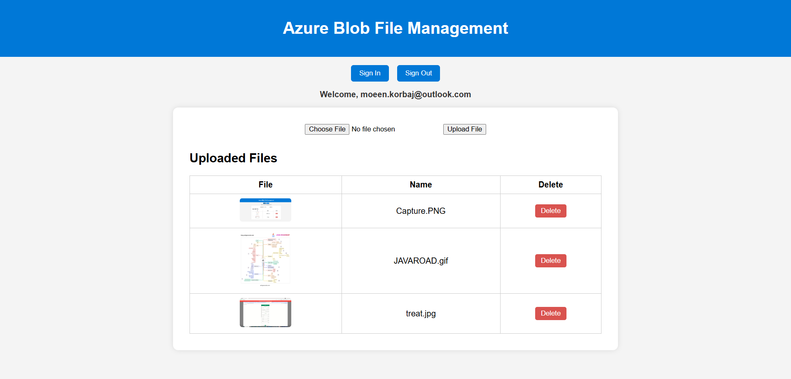

# 📁 Azure Blob File Management

## 📝 Project Description

This is a static web application hosted for free on **Azure Static Web Apps**, integrated with a **GitHub repository**. The app provides authenticated users the ability to upload, view, and delete files in an **Azure Blob Storage container**, depending on their role (admin or reader).

## ⚙️ Features

- Users authenticate using their **Microsoft accounts (Azure Entra ID)**.
- Two roles are supported:
  - **Admin**: Can upload, list, and delete files.
  - **Reader**: Can only view the uploaded files.
- Roles are defined in the **App Registration** and enforced via **role management** in Azure Static Web App.
- Azure Functions are used to securely call the blob container and use the **SAS Token**, which is stored in environment variables.
- Fully integrated with GitHub Actions for CI/CD: changes in the `master` branch are automatically deployed to Azure.

## 🔐 Access & Security

- Role-based access control (RBAC) using Azure Entra ID.
- All users must be invited and assigned roles via the Azure Portal.
- SAS tokens are **not exposed** to the client, ensuring security.

## 📸 Screenshot

## 🔁 GitHub Actions & Deployment

- Automatically deploys when pushing to the `master` branch.
- Uses a predefined GitHub Action workflow provided by Azure Static Web Apps.

## 🌐 Future Plans

- Connect a custom **DNS domain** to improve branding and access.
- Add temporary upload permissions with auto-expiry.

> Note: To fully simulate authentication and Azure Functions, deploy via Azure.

